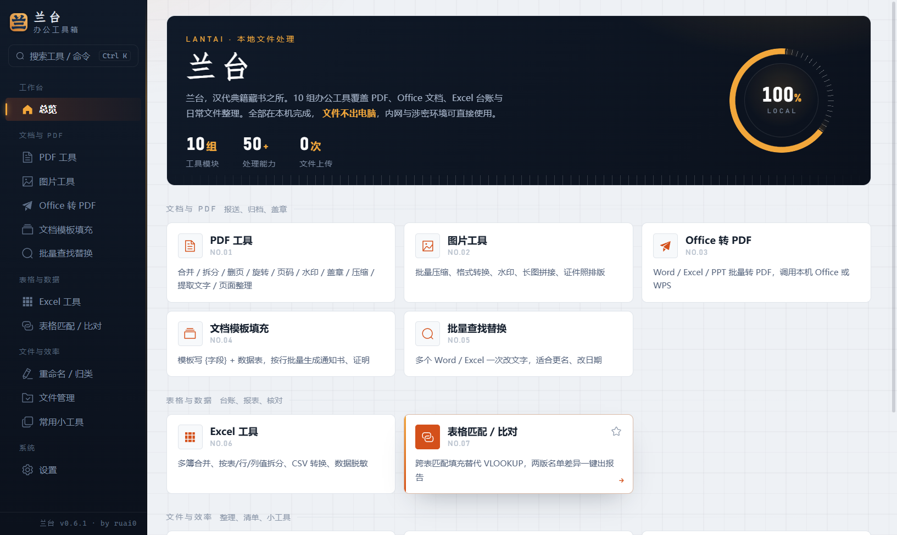
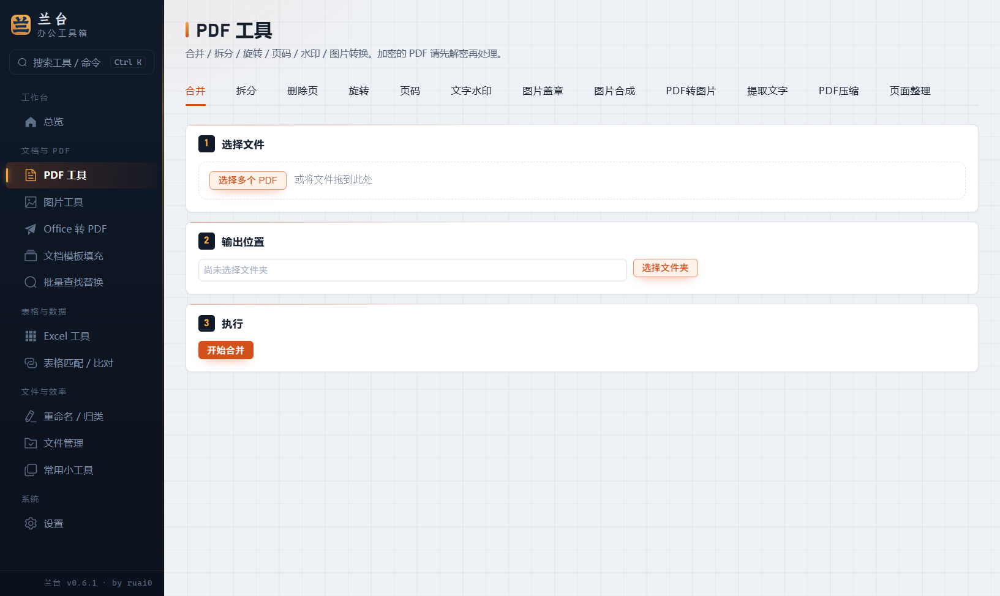
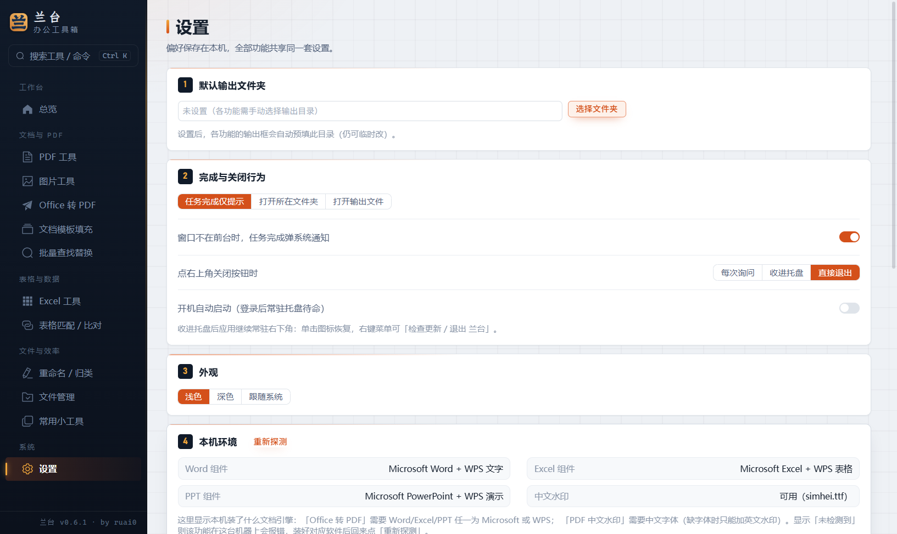

<div align="center">
  
  <h1>兰台 <sub>Lantai</sub></h1>
  <p>离线办公文书工具箱 · PDF / Office / Excel 批量处理 · 文件不出电脑</p>

  <p>
    <a href="https://github.com/ruai0/Lantai/releases/latest"></a>
    <a href="https://github.com/ruai0/Lantai/releases"></a>
    
    <a href="./LICENSE"></a>
  </p>
</div>



**为什么叫兰台**：兰台是汉代宫中藏书典籍之处，后世把档案机构雅称为兰台。这个软件干的就是把散乱的文书、台账、报送材料整理归档的活——名字即职责。

---

## 为什么选它

- **隐私即底线**：全部处理在本机完成，无账号、无遥测、不配置更新源时零网络请求，内网与涉密环境技术上完全可用（单位部署请获取授权，见「许可」）。
- **为批量而生**：合并几百页 PDF、整目录转格式、多表匹配比对，都是「选文件 → 执行」一步到位；重活有后台队列与进度，跑着也能切去干别的。
- **免安装也便携**：NSIS 安装版（自动更新）与单文件便携版任选，U 盘即插即用。

## 功能

| 模块 | 能力 |
|---|---|
| **PDF 工具** | 合并、拆分（提取页 / 逐页 / 分卷）、删页、旋转、页码、**文字水印**（中文/平铺/透明度/角度）、**图片盖章**、图片合成 PDF、PDF 转图片、提取文字、**压缩**（多档 dpi）、**页面整理**（跨文件重排重组） |
| **图片工具** | 批量压缩（JPG/PNG/WebP）、缩放、旋转翻转、文字/图片水印、**长图拼接**、**证件照排版**（一寸/二寸/护照按 300dpi 排满相纸） |
| **Excel 工具** | 多簿合并、按表/行/列值拆分、CSV⇄Excel（GBK 自动识别、保前导零）、**数据脱敏**（手机号/证件号/姓名，带抽样预览） |
| **表格匹配 / 比对** | 跨表匹配填充（VLOOKUP 替代，保留主表格式）、两版名单差异比对（删除/新增/变更四段式报告） |
| **Office 转 PDF** | Word/Excel/PPT 批量转 PDF，调用本机 Microsoft Office 或 WPS，逐文件报告成败 |
| **文档模板填充** | 模板写 `{字段}` + 数据表，按行批量生成通知书、证明 |
| **批量查找替换** | 多个 Word/Excel 一次改文字（更名、改日期、术语统一），逐文件计数 |
| **重命名 / 归类** | 冲突预检的批量重命名、按扩展名/年月自动归类，**执行后可一键撤销** |
| **文件管理** | 送审清单导出 Excel、重复文件查找（MD5）、ZIP 打包/批量解压 |
| **常用小工具** | JSON、Base64/URL、时间戳、UUID、哈希、二维码生成/识别、批量提取联系方式、名单加拼音、文本对比 |

平台特性：命令面板 `Ctrl+K`、工具收藏、任务队列与进度坞、系统托盘常驻、完成通知、深色模式、使用历史、环境探测（Office/WPS/中文字体）、自动更新、新用户指引。

## 下载与安装

到 [Releases](https://github.com/ruai0/Lantai/releases/latest) 下载：

| 文件 | 用途 |
|---|---|
| `lantai-setup-x.y.z.exe` | **Windows 安装版（推荐）**：安装向导 + 桌面快捷方式 + 自动更新 |
| `lantai-portable-x.y.z.exe` | **Windows 便携版**：双击即用，免安装，不参与自动更新 |
| `lantai-x.y.z-linux-amd64.deb` | **麒麟 / Linux 测试版（x86_64）**：兆芯 / 海光等机器，`sudo dpkg -i` 安装 |
| `lantai-x.y.z-linux-arm64.deb` | **麒麟 / Linux 测试版（arm64）**：飞腾 / 鲲鹏等 ARM64 机器（银河麒麟 V10 常见） |
| `lantai-x.y.z-linux-x86_64.AppImage` / `…-arm64.AppImage` | **麒麟 / Linux 测试版**：免安装单文件，`chmod +x` 后直接运行 |
| `SHA256SUMS.txt` / `SHA256SUMS-linux.txt` | 校验包完整性：Windows `certutil -hashfile 文件 SHA256`，Linux `sha256sum -c` |

> **系统要求**：Windows 版需 Win10 及以上、x64（Electron 44 不支持 Win7/8）；麒麟 / Linux 版为**测试版**，支持 x64 与 arm64，Office 转 PDF 依赖系统安装的 LibreOffice（未装会明确提示）。
> **首次运行提示**：安装包未做代码签名，Windows SmartScreen 可能蓝屏拦截——点「更多信息 → 仍要运行」即可；这是所有未签名小工具的正常现象，与软件安全无关。

## 自动更新

开箱即用：Windows 版默认从本仓库 Releases 检查更新，发现新版自动下载，右下角提示「重启安装」。上不了外网的机器可在「设置 → 软件更新」填内网镜像目录地址，或填 `off` 彻底禁用——禁用后应用不发起任何网络请求。

> 麒麟 / Linux 测试版暂不支持应用内自动更新，请从 Releases 手动下载新版 `.deb` / AppImage 覆盖安装。

## 设置一览

侧栏「设置」集中了全部偏好（存本机，全应用共享）：默认输出目录、任务完成行为、**关闭主窗口行为**（询问/收托盘/退出）、开机自启、外观（浅色/深色/跟随系统）、使用历史、本机环境探测、软件更新。

## 界面预览

| PDF 工具 | 设置 |
|---|---|
|  |  |

## 已知限制（v0.6）

- 加密 PDF 不支持（提示先解密）；Office 转 PDF 需要本机装有 MS Office 或 WPS（Windows）/ LibreOffice（麒麟 / Linux 测试版）。
- PDF 压缩是整页栅格化重建：文字型 PDF 转图片后文字不可复制，故提供多档分辨率。
- Excel 合并/拆分保留单元格值，不保留公式与样式；比对/脱敏取第一个工作表；不支持旧 .xls（Office 转 PDF 支持）。
- Word 替换在文本节点内生效，被排版拆开的词可能匹配不到；页眉页脚同。
- 二维码识别（jsQR）对严重模糊/倾斜/多码图可能失败；图片处理超大图（>50MP）内存占用高。
- ZIP 包内中文文件名用 UTF-8，老版 WinRAR 可能乱码（Win10+ 资源管理器正常）。

## 开发者

```bash
npm install
npm run dev         # 热更新开发
npm run test        # 单测 + 集成冒烟
npm run test:ui     # CDP 驱动真实界面 11 组场景
npm run release 0.6.2   # 一键发版（云端构建）
```

详见 [docs/development.md](docs/development.md)（架构与设计系统）与 [docs/operations.md](docs/operations.md)（发布流程、运维排障、调试入口）。

## 许可与反馈

- 许可：**个人免费、单位授权**（[LICENSE](LICENSE)）——个人学习研究与个人事务使用免费；任何单位（企业/政府/事业单位等）部署、使用、修改或分发，**包括内部办公用途**，均需事先获得作者书面授权。
- 反馈：提 [Issue](https://github.com/ruai0/Lantai/issues)，或应用内「设置 → 复制诊断信息」一键带上环境与日志。
- 作者：[ruai0](https://github.com/ruai0) · 设计文档见 [docs/](docs/)
